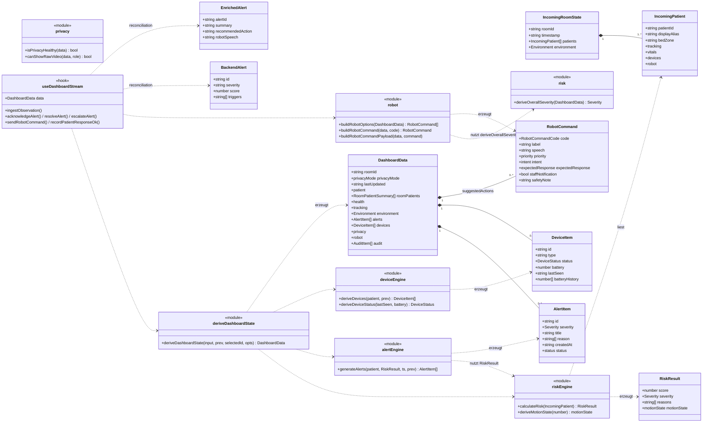

# Dashboard — Klassendiagramm

Datenmodelle (Zod-Schemata bzw. TypeScript-Typen) und die Berechnungs-Engines der Dashboard-Schicht. Funktionsmodule ohne Klassencharakter sind als `«module»` dargestellt. Ankerdateien: `src/types/*.ts`, `src/lib/*.ts`, `src/hooks/useDashboardStream.ts`.

## Kernaussagen

- **`deriveDashboardState` ist der Knotenpunkt** des Abhängigkeitsgraphen: Jede Datenquelle (Mock, WebSocket, manuelles JSON) läuft durch diese eine Funktion, die die drei Engines aufruft und ein validiertes `DashboardData` erzeugt.
- **Scoring (`calculateRisk`)** ist additiv gewichtet: `fallProbability × 0,4` plus Zuschläge für verlorenes Tracking, niedrige Konfidenz, Haltung, Bewegung, Immobilität, Vitalwert-Bänder; auf 0–100 begrenzt. Schwellen: `>=90 CRITICAL`, `>=75 HIGH`, `>=45 MEDIUM`, sonst `LOW`.
- **`BackendAlert`/`EnrichedAlert`** sind die autoritative Abgleichsschicht aus Main — das Dashboard versöhnt seine eigene Sofort-Einschätzung mit den Engine-Alarmen.
