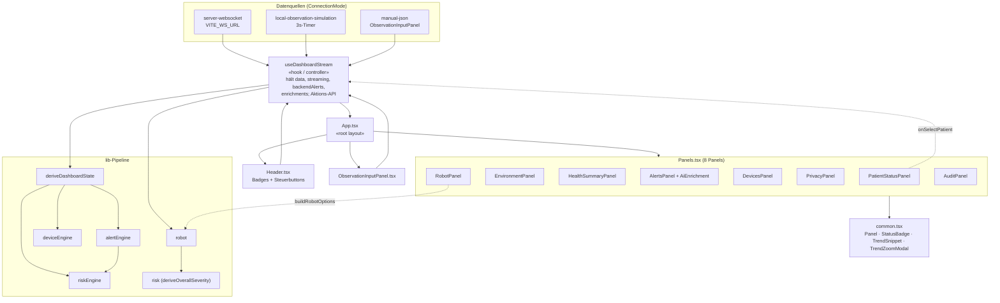

# Dashboard — Komponentendiagramm

Interne Struktur der React-Anwendung. Der Hook `useDashboardStream` wirkt als zentraler Controller/Façade; `App` verteilt Zustand und Callbacks an acht Panels.

## Kernaussagen

- **`useDashboardStream` ist die einzige Zustandsquelle** (kein Redux/MobX). Er besitzt `data: DashboardData` sowie die gesamte Aktions-API (Ingestion, Lifecycle, Simulation, Alarm-Workflow, Roboter-Workflow).
- **`EnvironmentPanel`** zeigt die echten ESP32-Raumdaten (im lokalen Simulationsmodus leer).
- **`AlertsPanel`** versöhnt lokale Alarme mit den autoritativen `backendAlerts` ("Engine-Strip") und zeigt die LLM-`enrichments`.
- **`common.tsx`** liefert wiederverwendbare Primitive inkl. SVG-Zeitreihen (`TrendSnippet`, `TrendZoomModal`).
