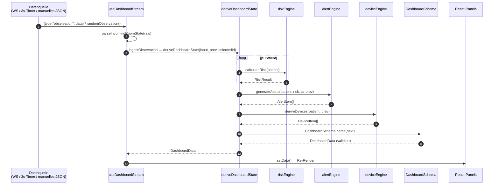
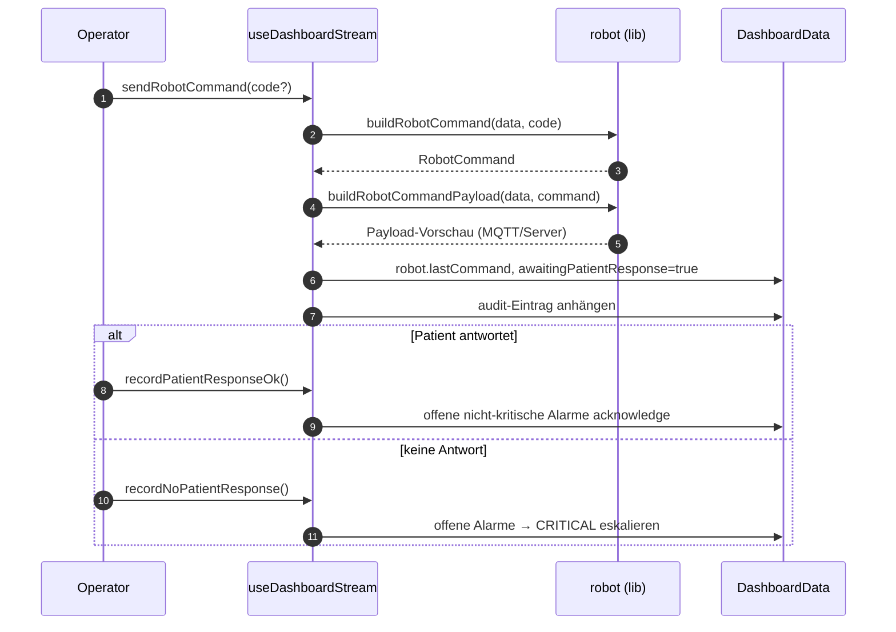

# Dashboard — Sequenzdiagramm

Zwei zentrale Abläufe der Dashboard-Schicht.

## Szenario A — Beobachtung eintreffen und rendern

## Szenario B — Roboterbefehl und Patientenantwort

> Hinweis: Bediener- und Roboteraktionen mutieren `DashboardData` direkt (nicht über `deriveDashboardState`) und hängen jeweils einen Eintrag an das gedeckelte `audit`-Log (~15 Einträge) an.
