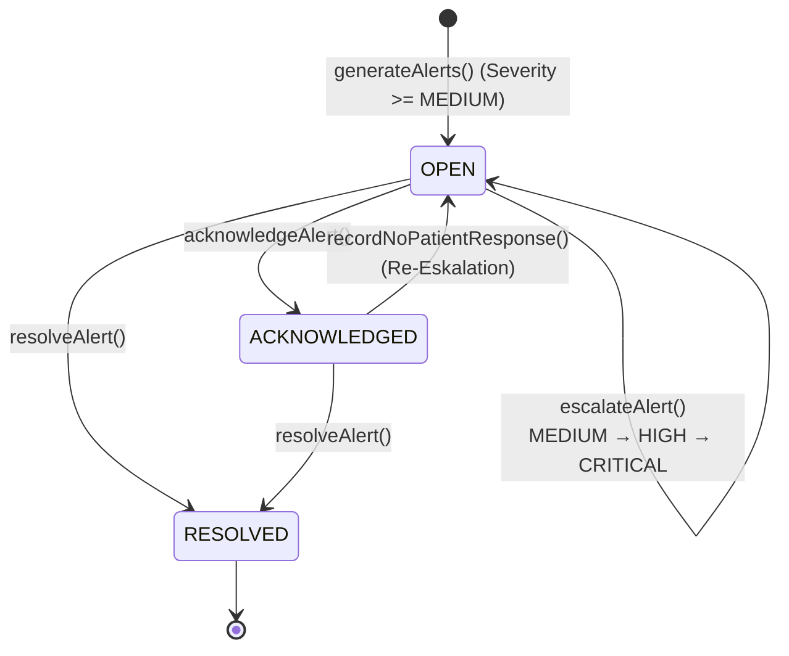
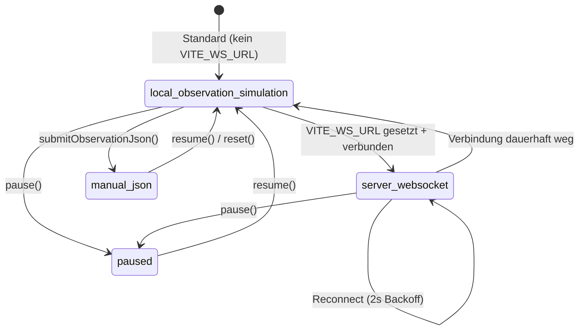
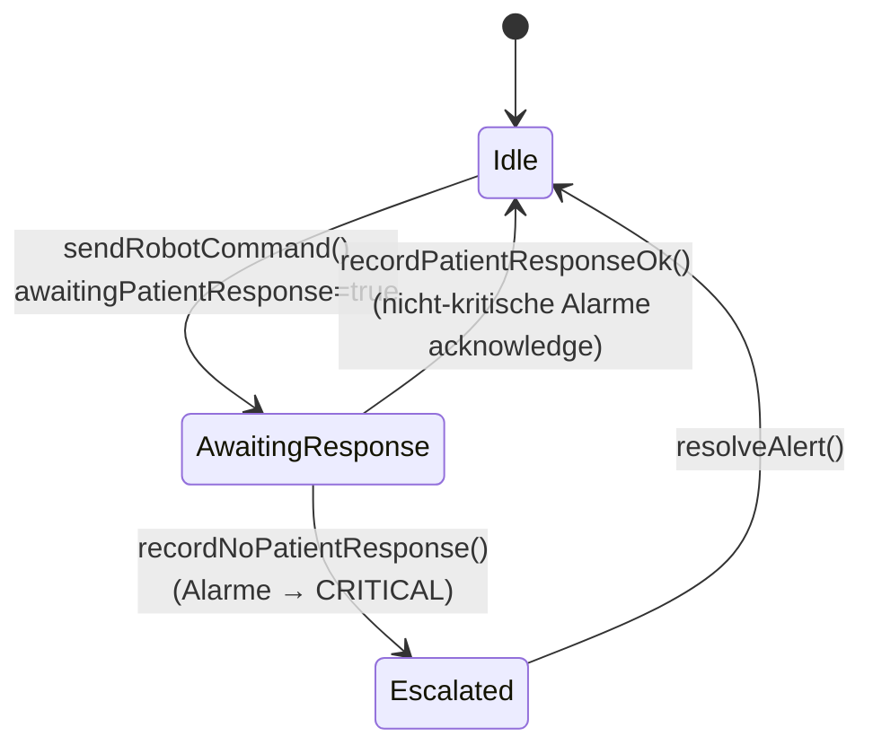

# Dashboard — Zustandsdiagramme

Drei Zustandsmaschinen der Dashboard-Schicht: Alarm-Lebenszyklus, Verbindungsmodus und Roboter-Antwortzyklus.

## Alarm-Lebenszyklus

## Verbindungsmodus (ConnectionMode)

## Roboter-Antwortzyklus

