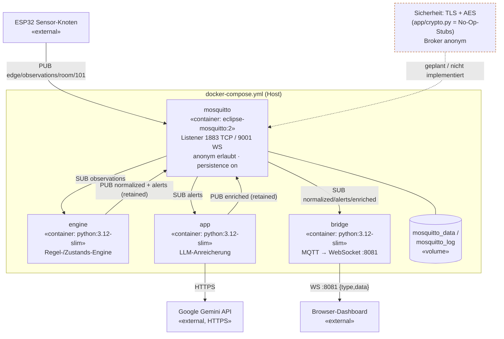

# Main — Komponenten-/Verteilungsdiagramm

Vier Docker-Compose-Container plus externe Gemini-API. Die Komponenten kommunizieren ausschließlich über MQTT-Topics (der Broker ist die einzige Kopplung); nur `bridge` öffnet zusätzlich einen WebSocket-Server nach außen.

## Kernaussagen

- **Keine Applikationsdatenbank.** Persistenz nur über MQTT-**Retained Messages** + Mosquitto-Volumes. Der In-Memory-Zustand (`RoomState`, App-Dedup-Dict, Bridge-Caches) geht bei Neustart verloren.
- **Externe Integration**: LLM über beliebigen OpenAI-kompatiblen Endpunkt (aktuell Gemini `gemini-2.5-flash`), per `.env` austauschbar.
- **Logging**: loguru mit rotierenden Dateilogs (10 MB / 7 Tage / gz).
- **Sicherheit**: als geplant/offen markiert (anonymer Broker, Crypto-Stubs).
