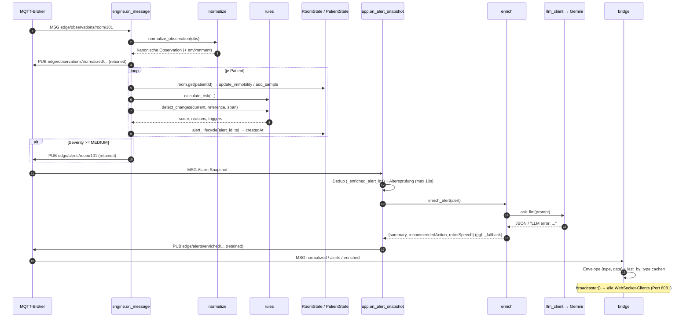
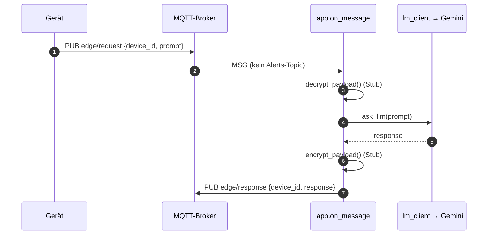

# Main — Sequenzdiagramm

## Hauptszenario — Beobachtung verarbeiten bis Bridge-Broadcast

```mermaid
sequenceDiagram
    autonumber
    participant Broker as MQTT-Broker
    participant Engine as engine.on_message
    participant Norm as normalize
    participant Rules as rules
    participant State as RoomState / PatientState
    participant App as app.on_alert_snapshot
    participant Enrich as enrich
    participant LLM as llm_client → Gemini
    participant Bridge as bridge

    Broker->>Engine: MSG edge/observations/room/101
    Engine->>Norm: normalize_observation(obs)
    Norm-->>Engine: kanonische Observation (+ environment)
    Engine->>Broker: PUB edge/observations/normalized/... (retained)
    loop je Patient
        Engine->>State: room.get(patientId) → update_immobility / add_sample
        Engine->>Rules: calculate_risk(...)
        Engine->>Rules: detect_changes(current, reference, span)
        Rules-->>Engine: score, reasons, triggers
        Engine->>State: alert_lifecycle(alert_id, ts) → createdAt
    end
    alt Severity >= MEDIUM
        Engine->>Broker: PUB edge/alerts/room/101 (retained)
    end

    Broker->>App: MSG Alarm-Snapshot
    App->>App: Dedup (_enriched_alert_ids) + Altersprüfung (max 10s)
    App->>Enrich: enrich_alert(alert)
    Enrich->>LLM: ask_llm(prompt)
    LLM-->>Enrich: JSON / "LLM error: ..."
    Enrich-->>App: {summary, recommendedAction, robotSpeech} (ggf. _fallback)
    App->>Broker: PUB edge/alerts/enriched/... (retained)

    Broker->>Bridge: MSG normalized / alerts / enriched
    Bridge->>Bridge: Envelope {type, data} + last_by_type cachen
    Note over Bridge: broadcaster() → alle WebSocket-Clients (Port 8081)
```

## Nebenszenario — Geräte-LLM-Runde

```mermaid
sequenceDiagram
    autonumber
    participant Dev as Gerät
    participant Broker as MQTT-Broker
    participant App as app.on_message
    participant LLM as llm_client → Gemini

    Dev->>Broker: PUB edge/request {device_id, prompt}
    Broker->>App: MSG (kein Alerts-Topic)
    App->>App: decrypt_payload() (Stub)
    App->>LLM: ask_llm(prompt)
    LLM-->>App: response
    App->>App: encrypt_payload() (Stub)
    App->>Broker: PUB edge/response {device_id, response}
```
