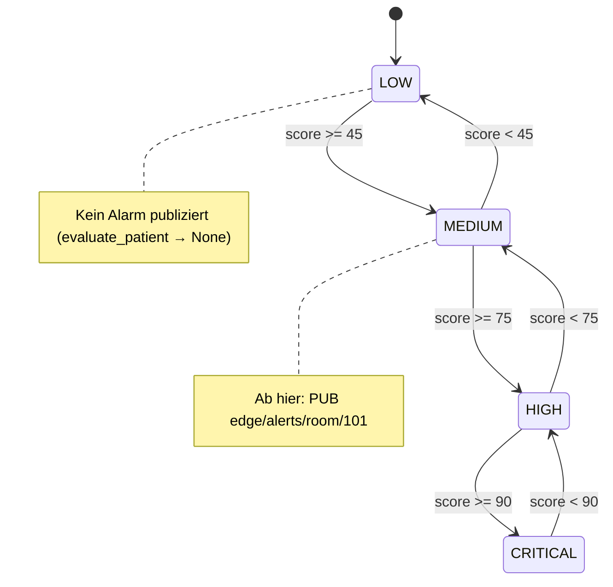
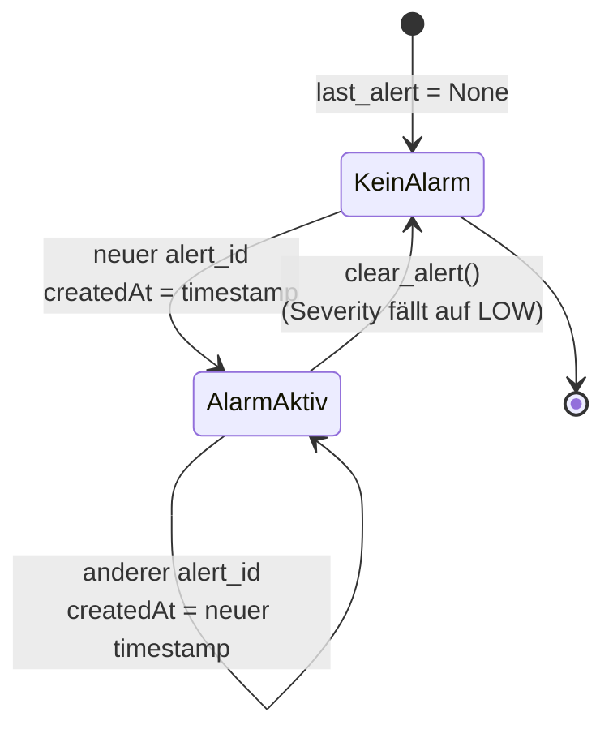
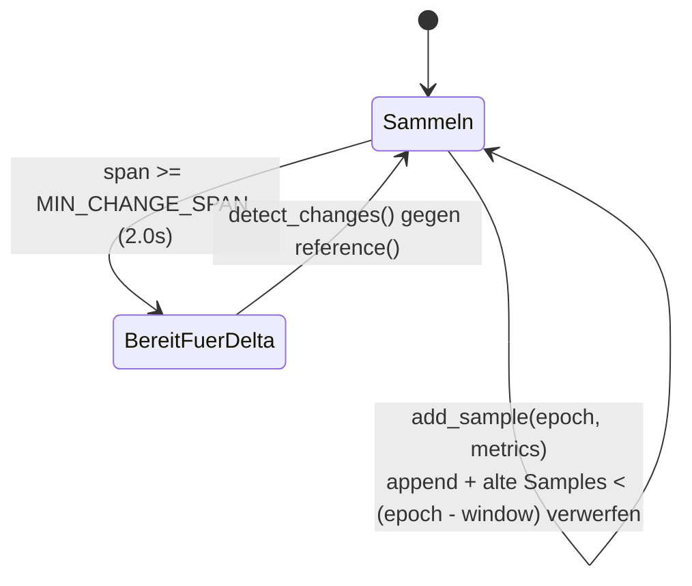

# Main — Zustandsdiagramme

## Severity-Schwellen (rules.severity_from_score)

Die Risikobewertung mappt einen Score (0–100) auf eine von vier Stufen. Alarme werden erst ab `MEDIUM` publiziert.

## Alarm-Dedup / -Lebenszyklus je Patient (PatientState.alert_lifecycle)

## Rollierendes Sample-Fenster (PatientState.add_sample)

> `window` = `CHANGE_WINDOW_SECONDS` (Konfig). Ein Delta wird erst vertraut, wenn mindestens `MIN_CHANGE_SPAN` (2,0 s) seit dem Referenz-Sample vergangen ist.
