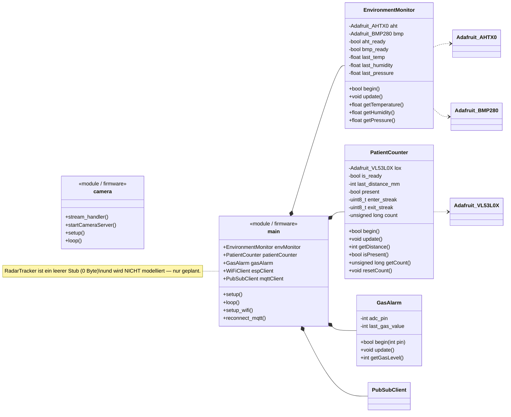

# Sensor — Klassendiagramm

Die ESP32-Firmware-Schicht. Der Sensor-Hub (`sensor_hub_node`) ist objektorientiert (drei Sensortreiber-Klassen); der Kamera-Knoten ist prozedural. Ankerdateien: `sensor_hub_node/lib/*`, `sensor_hub_node/src/main.cpp`, `camera_node/.../camera.ino`.

## Kernaussagen

- **`EnvironmentMonitor.begin()`** ist fehler-isolierend: liefert `true`, wenn **mindestens einer** der beiden Sensoren (AHT20 / BMP280 @ 0x77) lebt. `update()` schreibt bei Fehler den Sentinel `-999.0`.
- **`PatientCounter`** entprellt das flackernde VL53L0X-Signal: nur `RangeStatus == 0` wird vertraut, sonst wird der Zustand gehalten; Hysterese-Totband + N-Bestätigungen verhindern Phantomzählungen (siehe Zustandsdiagramm).
- **`main`** hält die drei Sensorobjekte plus `WiFiClient`/`PubSubClient` und ist der Firmware-Orchestrator (publish-only, fire-and-forget).
- **Kamera-Knoten** ist prozedural, ohne Klassen — ein reiner MJPEG-Streamer.
