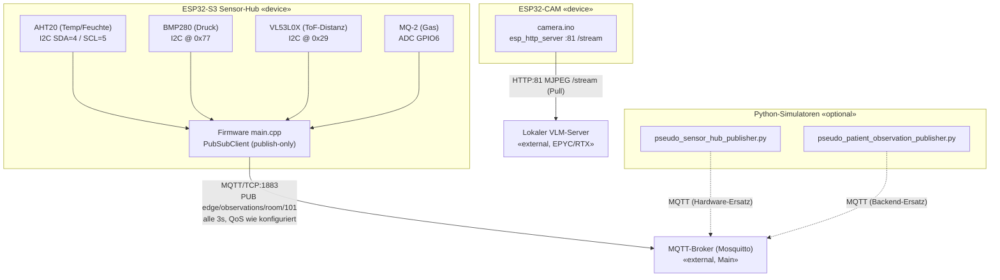

# Sensor — Komponenten-/Verteilungsdiagramm

Zwei unabhängige Hardware-Knoten plus optionale Python-Simulatoren als Hardware-/Backend-Ersatz.

## Kernaussagen

- **Sensor-Hub → MQTT/TCP:1883**, Topic `edge/observations/room/101`, alle 3 s, fire-and-forget. Buffer auf 1024 B erhöht wegen der großen JSON-Payload.
- **Kamera → HTTP:81 MJPEG (Pull)** — das Gerät ist ein "dummer Streamer"; der lokale VLM-Server zieht den Stream und führt die Vision-KI aus.
- **Python-Simulatoren** stehen wahlweise für die Hardware (`pseudo_sensor_hub_publisher`) oder die Backend-/KI-Schicht (`pseudo_patient_observation_publisher`) ein.
- **Konfiguration** (`main.cpp:18-28`): `ssid`, `password`, `mqtt_server`, `mqtt_port`, `mqtt_topic` sowie die Pin-Defines.

> Inkonsistenz: Die README-Dateien nennen abweichende Topics (`karlsruhe/medical/sensor_hub`, `edge/sensors/waiting_room_1/hub`). Maßgeblich ist der Code: `edge/observations/room/101`.
