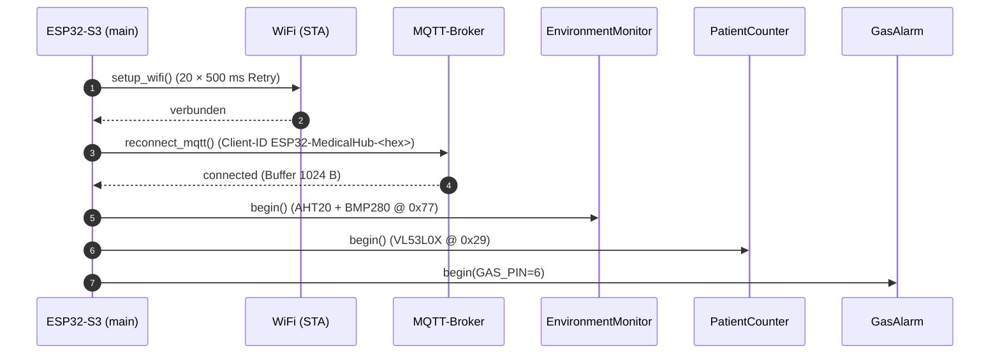
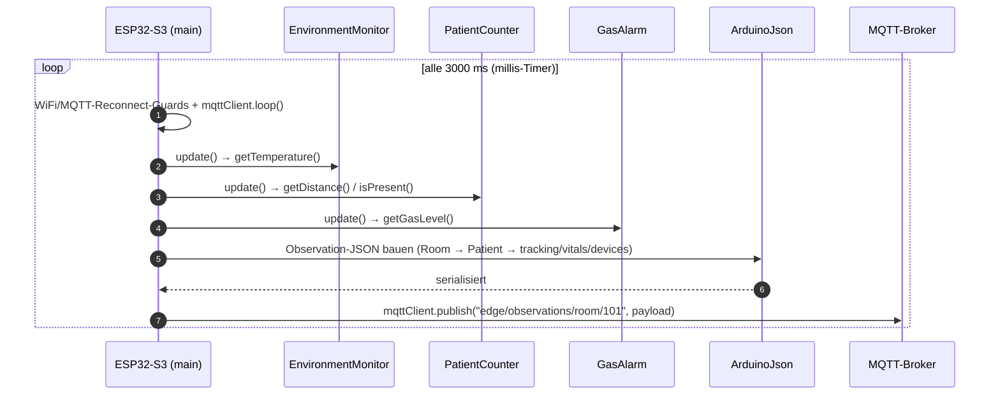
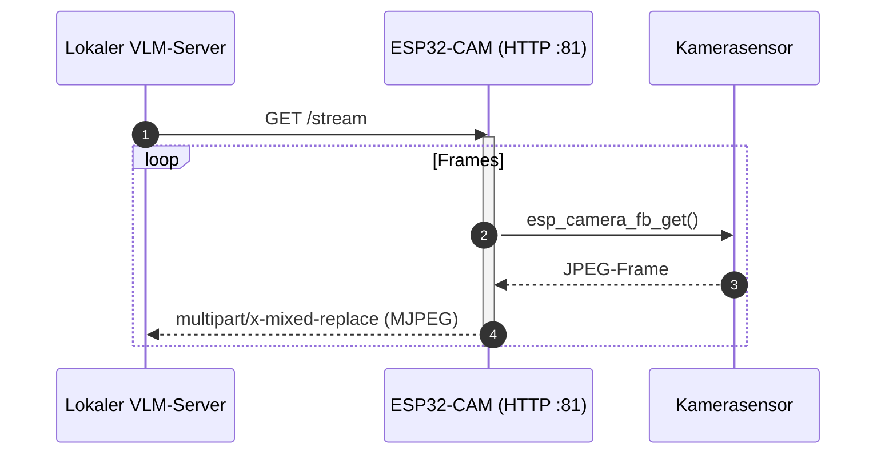

# Sensor — Sequenzdiagramme

## Szenario A — setup() (Boot)

## Szenario B — loop() (3-Sekunden-Takt)

## Szenario C — Kamera-Stream (Pull-Modell)

> Hinweis: Der Hub kennt keinen MQTT-Subscribe/Callback — er publiziert ausschließlich. Der Zeitstempel im JSON ist aus `millis()` gefälscht (kein RTC).
