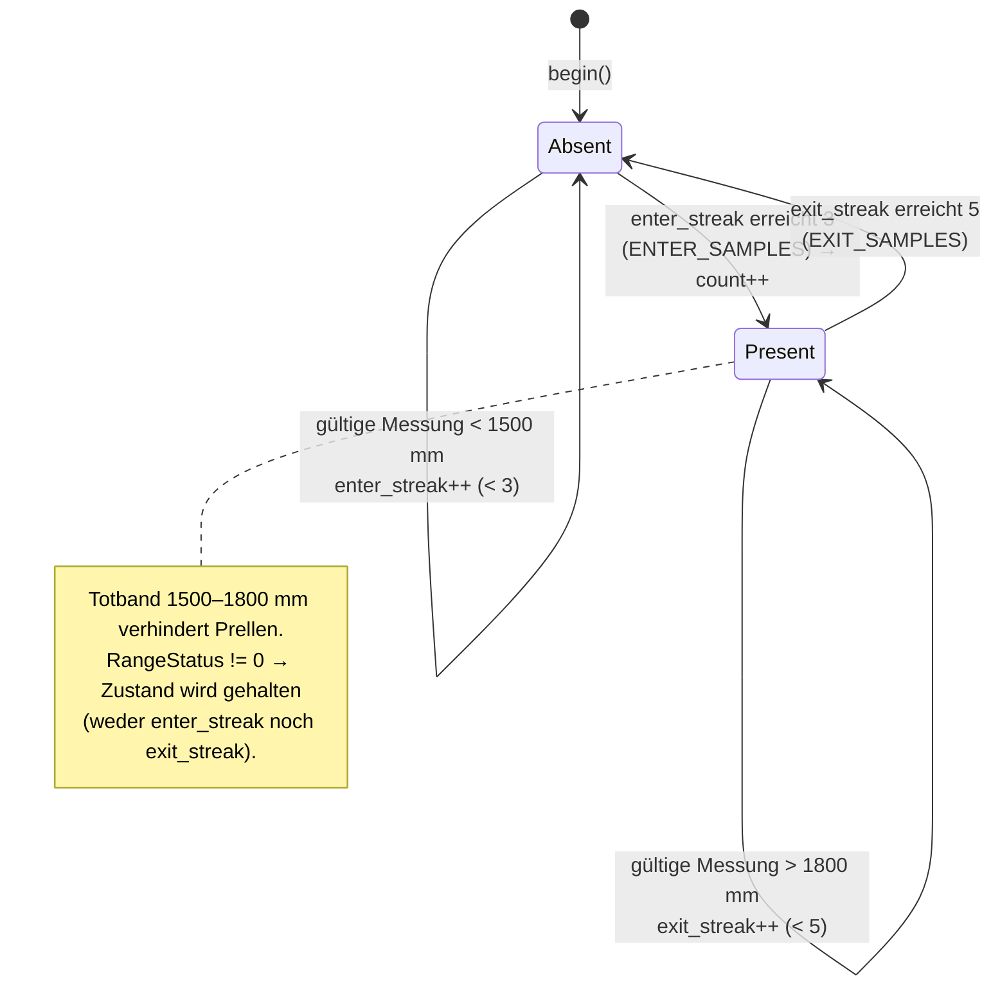
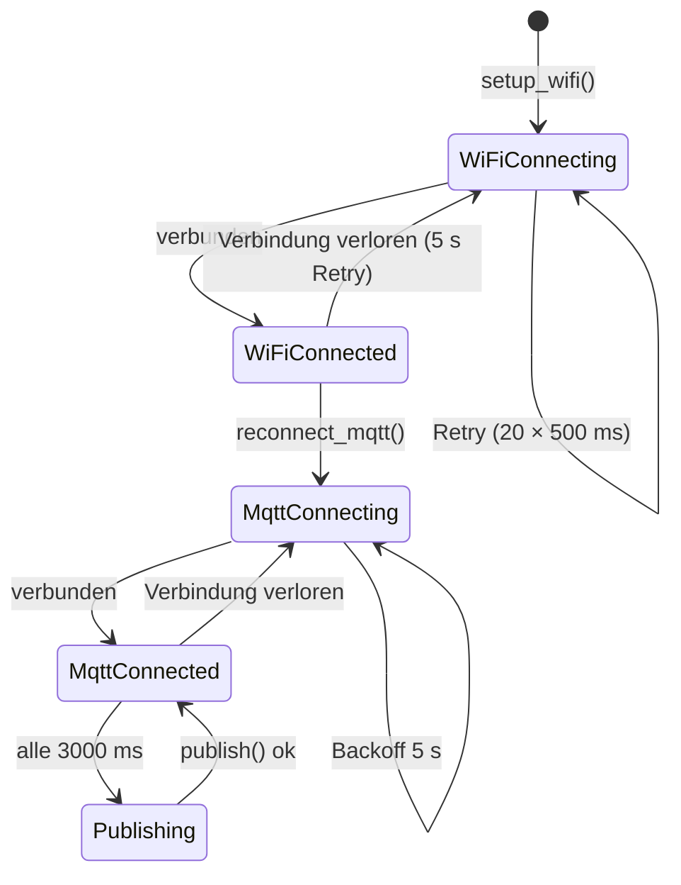

# Sensor — Zustandsdiagramme

## PatientCounter — Entprellte Anwesenheits-Zustandsmaschine

Das rohe VL53L0X-Signal flackert an der Erkennungsschwelle. Der Zähler entprellt mit Hysterese-Totband und N aufeinanderfolgenden Bestätigungen; eine fehlgeschlagene Messung (`RangeStatus != 0`) **hält** den Zustand. Konstanten aus `PatientCounter.cpp:6-12`.

## WiFi-/MQTT-Verbindungszustand (main loop)

