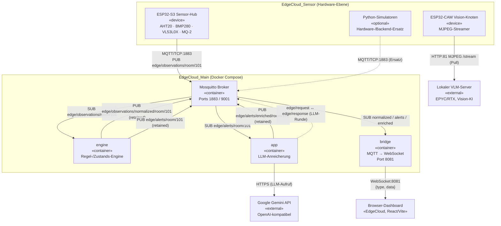

# System — Komponenten-/Verteilungsdiagramm

Überblick über alle drei Projekte: physische Knoten, Container und die Kommunikationswege (MQTT-Topics, WebSocket, HTTP). Die Beschriftungen an den Kanten geben Protokoll, Port und — bei MQTT — das Topic an.

## Kernaussagen

- **Zentraler Hub ist der MQTT-Broker** (Mosquitto). Alle Main-Dienste verbinden sich mit Retry bis der Broker bereit ist.
- **Retained Messages** ersetzen eine Datenbank: spät verbundene Consumer (z. B. ein frisch geladenes Dashboard) erhalten sofort den aktuellen Zustand.
- Das **LLM ist bewusst außerhalb des Entscheidungspfads** — es liefert nur Narration (`app`), niemals Severity-Werte.
- **Sicherheit ist noch nicht implementiert** (anonymer Broker, Crypto-Stubs) — hier als offener Punkt zu kennzeichnen.
