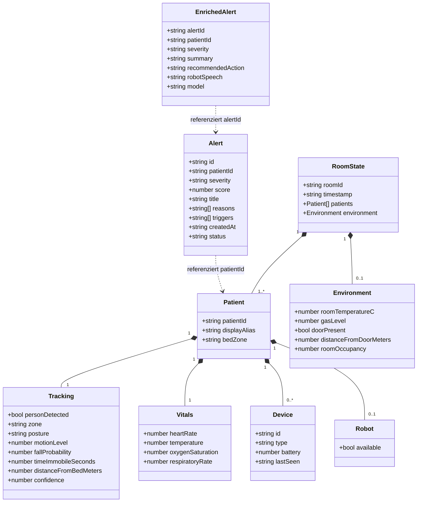

# System — Datenmodell (gemeinsamer JSON-Vertrag)

Die JSON-Schemata, die als Integrationsvertrag zwischen allen drei Projekten fließen. Es gibt keine gemeinsame Programmiersprache — die Struktur wird auf der Dashboard-Seite mit Zod validiert und auf der Main-Seite in `normalize.py` erzeugt.

## Herkunft der Felder (echt vs. simuliert)

| Feld | Herkunft |
|---|---|
| `tracking.distanceFromBedMeters` | **echt** — VL53L0X ToF (Sensor) |
| `vitals.temperature` | **echt** — AHT20/BMP280 (Umgebungstemperatur, Sensor) |
| `environment.gasLevel` / `gas_adc_level` | **echt** — MQ-2 ADC (Sensor) |
| `environment.roomOccupancy` | abgeleitet — Türzähler in `normalize.py` |
| `tracking.posture`, `fallProbability`, `personDetected` | **simuliert/geplant** — soll aus Vision-KI stammen |
| `vitals.heartRate`, `oxygenSaturation`, `respiratoryRate` | **simuliert** — Platzhalter (`SIM_VITALS`) |
| `Alert.severity`, `score`, `triggers` | abgeleitet in `engine` (Main) |
| `EnrichedAlert.*` | erzeugt vom LLM in `app` (Main) |

> Hinweis: `temperature` des Sensor-Knotens ist eigentlich **Umgebungstemperatur** und wird von `normalize.py` in den `environment`-Block umgeleitet; die Körpertemperatur wird simuliert.
