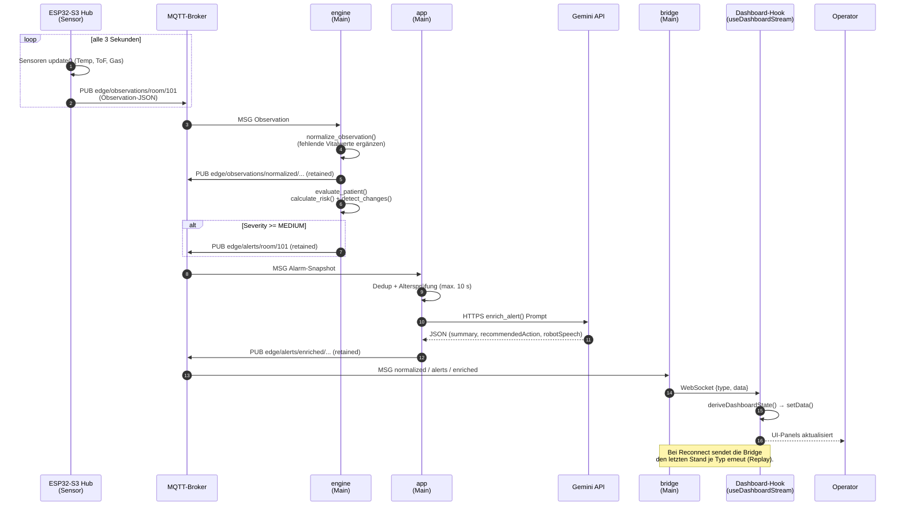
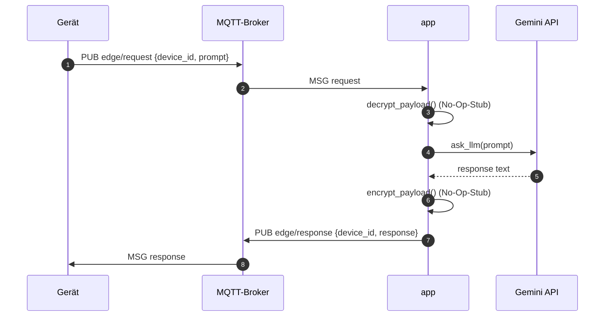

# System — End-to-End-Sequenzdiagramm

Der Hauptszenario-Datenfluss von einer Sensormessung bis zur gerenderten UI, über alle drei Projekte hinweg.

```mermaid
sequenceDiagram
    autonumber
    participant Hub as ESP32-S3 Hub<br/>(Sensor)
    participant Broker as MQTT-Broker
    participant Engine as engine<br/>(Main)
    participant App as app<br/>(Main)
    participant Gemini as Gemini API
    participant Bridge as bridge<br/>(Main)
    participant Dash as Dashboard-Hook<br/>(useDashboardStream)
    participant Op as Operator

    loop alle 3 Sekunden
        Hub->>Hub: Sensoren update() (Temp, ToF, Gas)
        Hub->>Broker: PUB edge/observations/room/101<br/>(Observation-JSON)
    end

    Broker->>Engine: MSG Observation
    Engine->>Engine: normalize_observation()<br/>(fehlende Vitalwerte ergänzen)
    Engine->>Broker: PUB edge/observations/normalized/... (retained)
    Engine->>Engine: evaluate_patient()<br/>calculate_risk() + detect_changes()
    alt Severity >= MEDIUM
        Engine->>Broker: PUB edge/alerts/room/101 (retained)
    end

    Broker->>App: MSG Alarm-Snapshot
    App->>App: Dedup + Altersprüfung (max. 10 s)
    App->>Gemini: HTTPS enrich_alert() Prompt
    Gemini-->>App: JSON (summary, recommendedAction, robotSpeech)
    App->>Broker: PUB edge/alerts/enriched/... (retained)

    Broker->>Bridge: MSG normalized / alerts / enriched
    Bridge->>Dash: WebSocket {type, data}
    Dash->>Dash: deriveDashboardState() → setData()
    Dash-->>Op: UI-Panels aktualisiert

    Note over Bridge,Dash: Bei Reconnect sendet die Bridge<br/>den letzten Stand je Typ erneut (Replay).
```

## Nebenszenario — Geräte-LLM-Runde

```mermaid
sequenceDiagram
    autonumber
    participant Dev as Gerät
    participant Broker as MQTT-Broker
    participant App as app
    participant Gemini as Gemini API

    Dev->>Broker: PUB edge/request {device_id, prompt}
    Broker->>App: MSG request
    App->>App: decrypt_payload() (No-Op-Stub)
    App->>Gemini: ask_llm(prompt)
    Gemini-->>App: response text
    App->>App: encrypt_payload() (No-Op-Stub)
    App->>Broker: PUB edge/response {device_id, response}
    Broker->>Dev: MSG response
```
