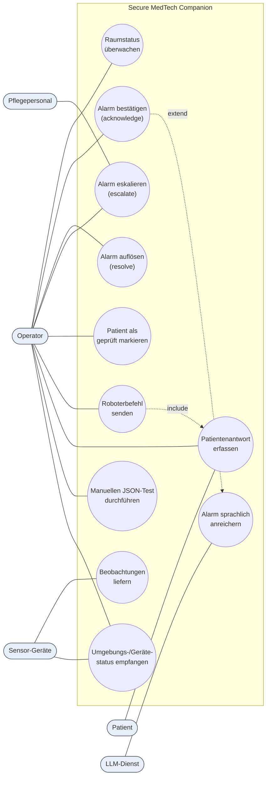

# System — Anwendungsfalldiagramm

Akteure und ihre Anwendungsfälle über das Gesamtsystem. Mermaid kennt kein natives Use-Case-Diagramm; es wird als Graph mit ovalen Anwendungsfällen (Ellipsen) und rechteckigen Akteuren modelliert.

## Erläuterung der Akteure

- **Operator** — Hauptnutzer der Dashboard-UI; steuert den gesamten Alarm- und Roboter-Workflow.
- **Pflegepersonal** — Empfänger von Eskalationen/Benachrichtigungen (`staffNotification` in Roboterbefehlen).
- **Patient** — interagiert mit dem Roboter (Sprachaufforderung, Antwortbestätigung).
- **Sensor-Geräte** — ESP32-Hub/Kamera liefern Beobachtungen und Umgebungsdaten.
- **LLM-Dienst** — externer Gemini-Endpunkt, erzeugt ausschließlich Narration.
